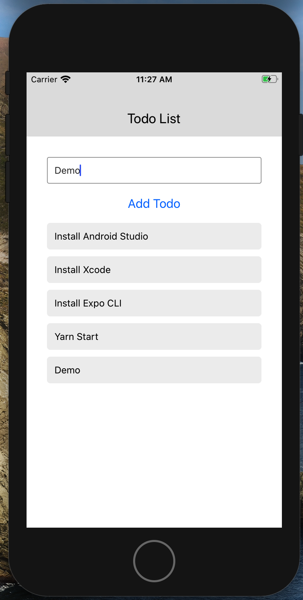

# Todo using Expo Cli

## Tools

__React Native CLI__

- Install : `sudo npm i -g react react-native-cli`
- Project Start : `react-native init project-name`
- Diferrent installtion based on OS
- Manually setup and configure dependency 
- Gives you full flexibility


__Expo CLI__

- Install : `sudo npm install -g expo-cli`
- Start Project: `expo init project-name`
- Same installation step in Mac / Win
- Managed Workflow
- Limited to Expo ecosystem

```bash
cd expo-scratch
yarn start # you can open iOS, Android, or web from here, or run them directly with the commands below.
yarn android
yarn ios
yarn web
```


<strong>Note : we can alwasy switch back from "Expo Cli" to "React Native Cli"</strong>


### Components

- React Native includes built in Components and APIs

- __Basic Components__ : View, Text, Image, TextInput, ScrollView, StyleSheet
- __UI__ : Button, Picker, Slider, Switch
- __List Views__ : FlatList, SectionList
- __iOS__ : ActionSheetIOS, AlertIOS etc
- __Android__ : BlackHeandler, DatePickerAndroid

### Commands

- Reload menu open : `CMD + M` on Android


## Start

- Download the repo
- `yarn start`


## Demo



## Code 

- `App.js`

```jsx
import { StatusBar } from 'expo-status-bar';
import React, { useState } from 'react';
import { StyleSheet, Text, View, Button, TextInput, ScrollView } from 'react-native';
import Header from './src/components/Header'

export default function App() {

  const [ todoItem, setTodoItem] = useState('')
  const [ todoList, setTodoList ] = useState([])

  const textHandler = textEntered => {
    //console.log(textEntered)
    setTodoItem(textEntered)
  }

  const addTodoList = () => {
    setTodoList([...todoList, todoItem ])
    //console.log(todoList)
  }
  return (
    <View>
      <Header title="Todo List"/>
      <View style={styles.container}>
        <View>
          <TextInput 
          placeholder="Enter Todo"
          onChangeText={textHandler}
          value={todoItem}
          style={styles.textInput}
          />
          <Button 
          title="Add Todo"
          onPress={addTodoList}
          />
        
        </View>
        <ScrollView>
          {todoList.map((todo, i) =><View style={styles.todoItem} key={i}><Text>{todo}</Text></View>)}
        </ScrollView>
        <View>
          <StatusBar style="auto" />
        </View>      
      </View>
    </View>
  );
}

const styles = StyleSheet.create({
  container: {
    padding: 30
  },
  textInput: {
    padding: 10,
    color: "#333333",
    marginBottom: 10,
    borderWidth: 1,
    borderColor: '#999999',
    borderRadius: 3,
  },
  todoItem: {
    marginTop: 10,
    padding: 10,
    backgroundColor: "#efefef",
    borderRadius: 5,
    borderWidth: 1,
    borderColor: "#efefef",
  }
})
```

- `Header.js`

```jsx
import React from 'react'
import { StyleSheet, View, Text } from 'react-native'

export default function Header(props) {
    return (
        <View style={styles.header}>
            <Text style={styles.headerTitle}>{props.title}</Text>
        </View>
    )
}

const styles = StyleSheet.create({
    header:{
        backgroundColor: '#e1e1e1',
        padding: 15,

    },
    headerTitle:{
        marginTop: 40,
        textAlign: 'center',
        fontSize: 20,
    }
})
```
